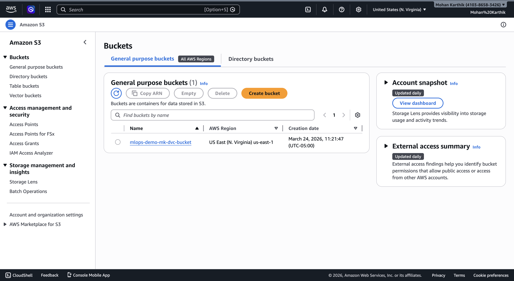
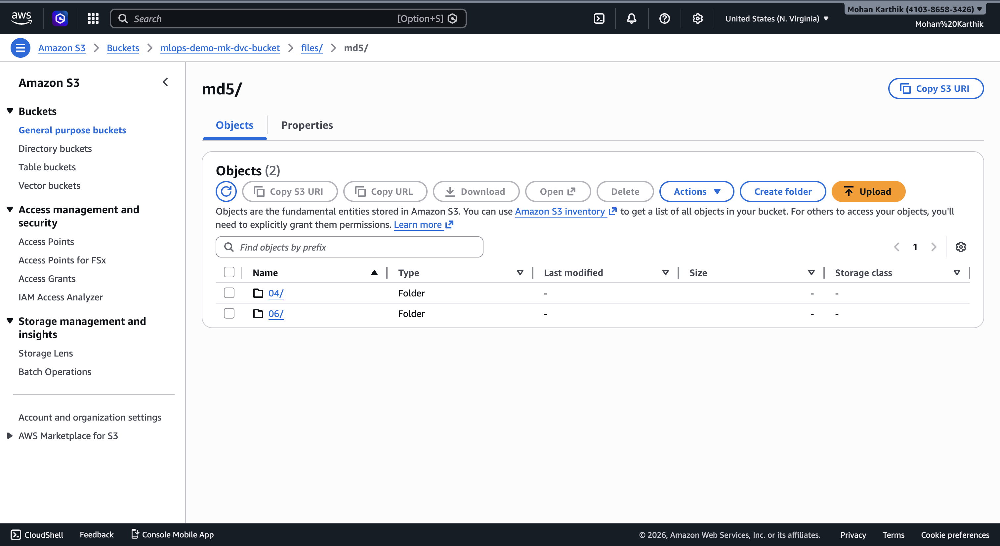

# 🍷 Wine Quality Prediction (MLOps Demo)

A simple Machine Learning project to predict wine quality using a **Random Forest Regressor**, with:

- 🚀 **DVC** for dataset versioning
- ☁️ **AWS S3** as the DVC remote
- 🧪 **PyTest** for unit testing
- 🔍 **MLflow** for experiment tracking
- 📦 Organized source code in `src/`

This repository demonstrates a clean, reproducible workflow suitable for MLOps portfolios.

## 📸 S3 Dataset Storage (Screenshots)

Below are the screenshots of the AWS S3 bucket where the dataset is stored as a remote for DVC.

### 📁 S3 Bucket List


This screenshot shows the bucket created in your AWS account named:


Which acts as the remote store for DVC.

---

### 📂 S3 md5 Folder Contents


This screenshot shows the DVC‑generated md5 folder under `files/`, which contains hashed dataset chunks managed by DVC.

---

## 🔍 Why Use DVC + AWS S3?

During **Udemy MLOps Section‑4**, we learn:

✔ How to version datasets using `dvc add`  
✔ How to push dataset files to S3 with `dvc push`  
✔ How the md5 hashing works behind the scenes  
✔ How to keep the dataset out of Git but still versioned

With this approach:
- Git tracks *only pointers* (`.dvc` files)
- S3 stores the actual dataset
- Data remains versionable, shareable, and reproducible

---

## 💻 Project Structure

```
wine_prediction_demo/
├── data/
│   ├── wine_sample.csv.dvc    # DVC pointer
│   └── wine_sample.csv        # Actual data (pulled via DVC)
├── src/
│   ├── __init__.py
│   ├── train.py               # Standalone training script
│   ├── utils.py               # Data helpers
│   └── requirements.txt       # Python dependencies
├── tests/
│   ├── __init__.py
│   └── test_main.py           # Pytest tests
├── .gitignore
└── README.md
   ```

## 🛠️ Setup Instructions

   1. Clone the Repository
      ```
      git clone https://github.com/Mohan12karthik/MLOPs-wine_prediction_demo.git
      cd MLOPs-wine_prediction_demo
      ```

   2. Create & Activate a Virtual Environment
      ```
      python3 -m venv .venv
      source .venv/bin/activate
      ```
      
   3. Install Dependencies
      ```
      pip install -r src/requirements.txt
      ```
      
   5. Configure AWS Credentials (for DVC remote)
      ```
      aws configure
      ```
      ⚠️ Make sure your AWS Access Key and Secret Key have the correct IAM permissions. Do not commit credentials to Git.

   6. Push Dataset to DVC Remote

      If you have updated or added a new dataset:
      ```
      dvc add data/wine_sample.csv
      git add data/wine_sample.csv.dvc
      git commit -m "Add/update dataset version"
      dvc push
      ```
      This uploads the dataset to your configured S3 remote.

   7. View Dataset in AWS S3

      Go to your AWS S3 console and navigate to your bucket (e.g., mlops-demo-mk-dvc-bucket). You should see the md5 folder containing the hashed dataset chunks managed by DVC.

      This will download the actual dataset from the S3 remote.

## 📝 Notes & Best Practices

 - Always activate your virtual environment before running scripts.

 - Dataset files are tracked via DVC, not Git.

 - To add new data: dvc add <file> → commit .dvc file → dvc push.

 - Rerun training with the same seed for reproducibility.

## 👨‍💻 Author

`Mohan Karthik Vijayakumar`

